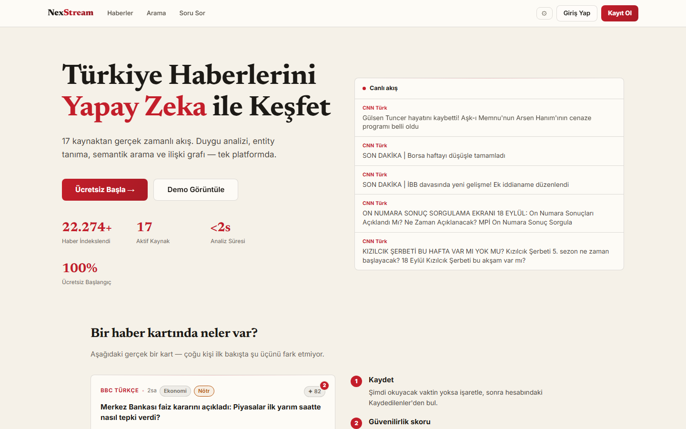
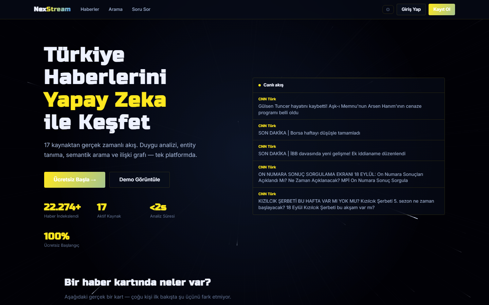
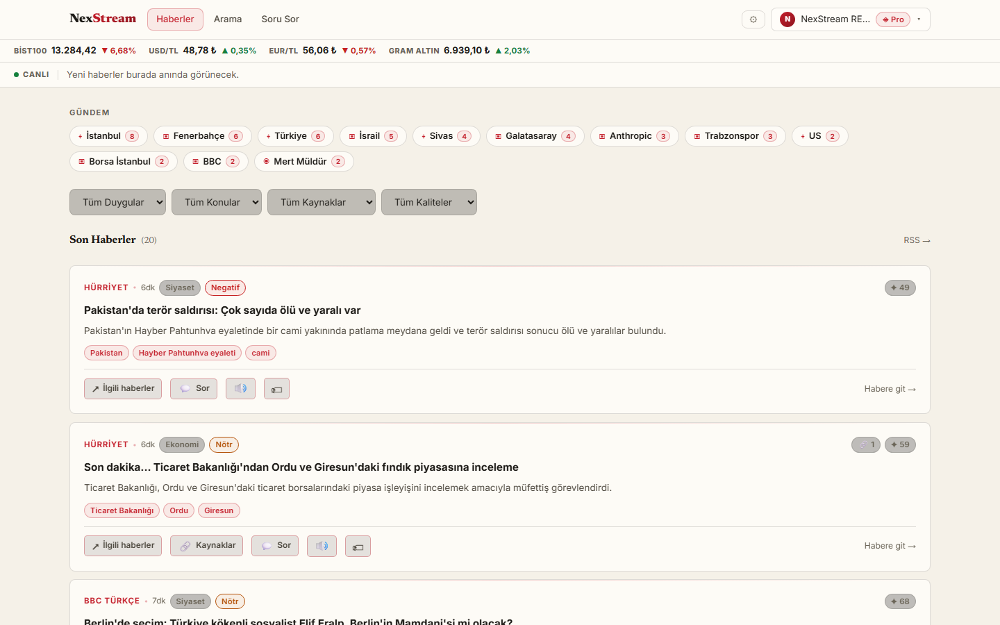
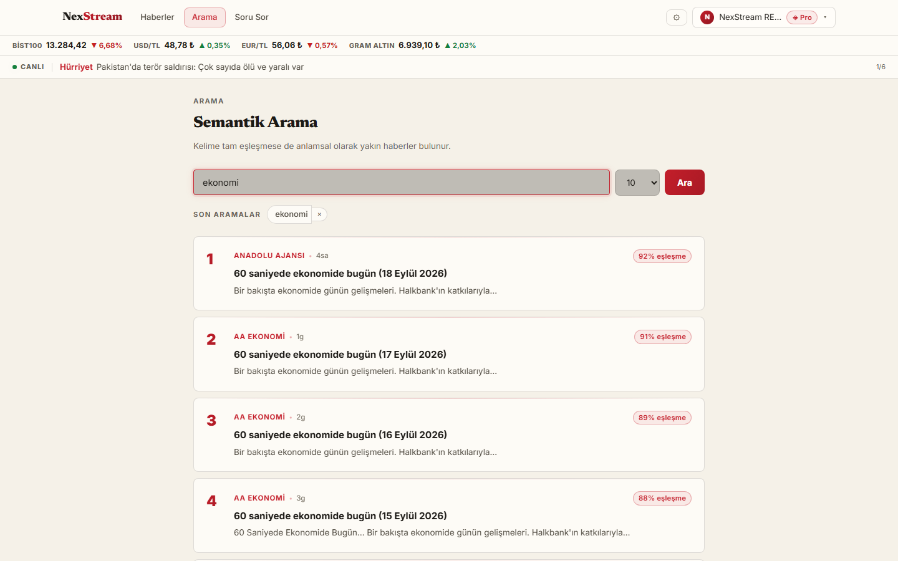
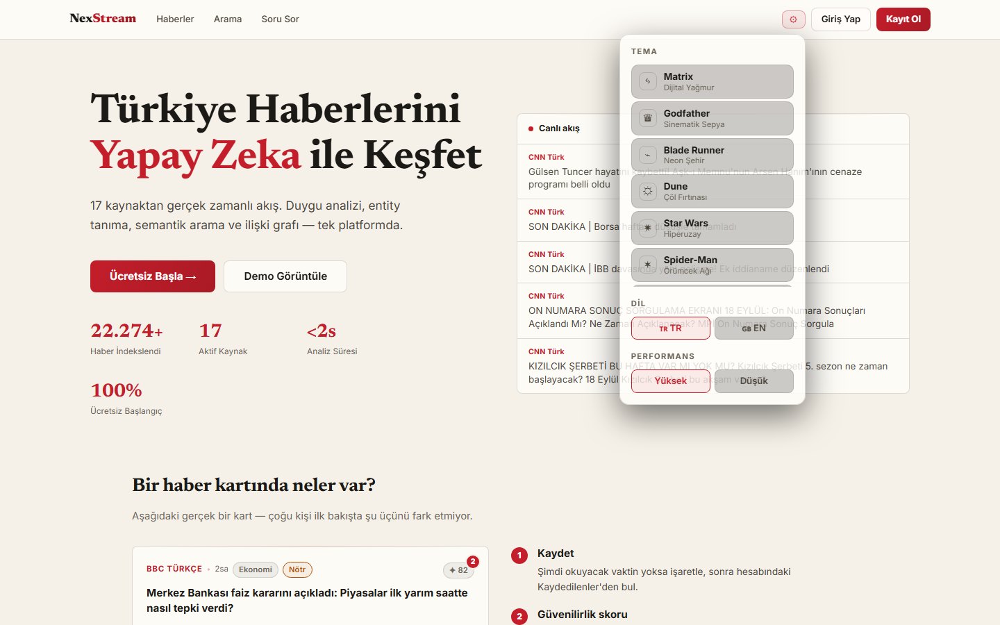
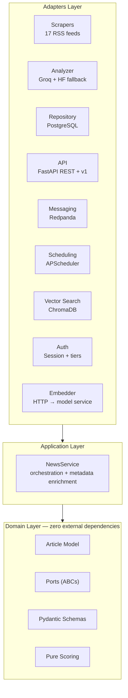
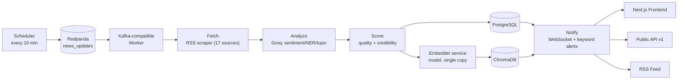
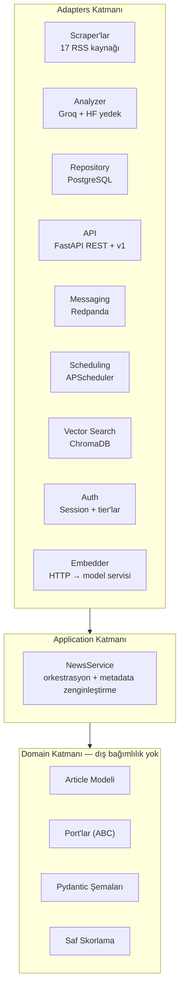
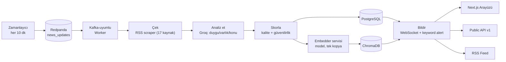

<div align="center">

# NexStream News Engine

**AI-Powered Multi-Source News Intelligence Platform**

[](https://github.com/MaviMakumba/NexStream-News-Engine/actions/workflows/tests.yml)


[English](#english) · [Türkçe](#turkce)

</div>

---

<a name="english"></a>
## English

### Overview

NexStream is an event-driven news aggregation and intelligence platform. It continuously collects articles from **17 sources** in Turkish and English, runs them through an AI pipeline (sentiment, named-entity recognition, topic classification, summarization, plus quality and source-credibility scoring), enables hybrid semantic + keyword search, and surfaces everything through a **Next.js frontend with a cinematic, multi-theme UI**.

What started as a course project on enterprise architecture has grown into a production-shaped SaaS: user accounts with email verification, a **genuinely tier-gated** public API with usage metering, Stripe billing, a real-time WebSocket feed with per-connection limits, email newsletters, a full observability stack, and a security-hardened deployment path (rate limiting, secret rotation discipline, prod-config guardrails, automated dependency updates).

**Key capabilities:**
- **17 sources** (11 Turkish + 6 English), added declaratively via a scraper registry
- **AI pipeline** on Groq `llama-3.1-8b-instant`: sentiment + entities (people/orgs/locations) + topic + summary in a single prompt, with an optional Hugging Face fallback
- **Hybrid search**: ChromaDB semantic vectors + PostgreSQL keyword, combined-score ranked with recency decay, Turkish morphological stemming
- **Trending engine**, **related-article graph** (entity overlap, Pro+), and **semantic dedup**
- **Quality + credibility scoring**: deterministic content-quality score and source-credibility / corroboration metrics
- **Real-time WebSocket feed** (Pro+, per-user + global connection caps), **email newsletter + instant keyword alerts**, **RSS/Atom feed**
- **User accounts** with email verification, session auth (HttpOnly cookies), **tiered API** (Free / Pro / Enterprise) with per-user rate limits, per-tier search-result caps, and usage analytics
- **Stripe billing** (with a no-Stripe dev mode for local demos), **raw data export** (CSV/JSON, Enterprise-only), **Redis cache**
- **Role-based admin** (user / moderator / admin hierarchy + `ADMIN_EMAILS` bootstrap), **self-service usage dashboard**, and **personal API keys** (`X-User-Key`) for the public API
- **Next.js 14 frontend**: 9 cinematic themes with animated Canvas backgrounds (low/high performance profiles), full TR/EN i18n, WCAG AA-checked contrast, installable **PWA**
- **Event-driven** via Redpanda (Kafka-compatible, ARM-friendly); **fully containerized** with Docker Compose
- **Observability**: Prometheus + Grafana + Loki, `/health` and `/metrics` endpoints
- **Security-hardened**: prod-startup config guard, timing-safe auth checks, HTML-escaped emails, per-route rate limits, encrypted + offsite-capable backups
- **553 tests**, all green; CI via GitHub Actions with Dependabot-driven dependency updates

**At a glance:**

| Metric | Value |
|--------|-------|
| News sources | 17 (11 Turkish + 6 English) |
| Backend tests | 553 — all green |
| API endpoints | 49, across 13 routers |
| Cinematic frontend themes | 9 |
| API tiers | 3 (Free / Pro / Enterprise) — server-enforced |
| Docker services | 10 (dev) / 16 (prod, incl. observability stack) |
| Architecture | Hexagonal (Ports & Adapters), 3 layers |

---

### Screenshots

| Landing — Matrix theme | Landing — Star Wars theme |
|---|---|
|  |  |

| Dashboard (live data, trending, tier badges) | Semantic search (match % per result) |
|---|---|
|  |  |


<p align="center"><sub>All screenshots taken from a live local run against real scraped data.</sub></p>

---

### Architecture

NexStream is built on **Hexagonal Architecture (Ports & Adapters)**. The domain layer has zero knowledge of external systems; adapters implement ports and are wired together in `dependencies.py`. Dependency direction is strictly **Adapter → Application → Domain**.



**Event flow:**



---

### Tech Stack

| Layer | Technology |
|-------|-----------|
| Frontend | Next.js 14 + React + TypeScript — 9 cinematic themes (pure CSS + Canvas), installable PWA |
| API | FastAPI + Uvicorn (REST + versioned `/api/v1`) |
| Auth & limits | Session tokens (bcrypt), slowapi rate limiting, per-tier quotas |
| Message broker | Redpanda (Kafka-compatible, single-node) |
| AI analyzer | Groq `llama-3.1-8b-instant` (+ optional Hugging Face fallback) |
| Embeddings | `paraphrase-multilingual-MiniLM-L12-v2` (local, no API key) |
| Vector search | ChromaDB (persistent) |
| Database | PostgreSQL 15 + SQLAlchemy ORM |
| Cache | Redis 7 (sessions / trending; null-cache fallback) |
| Payments | Stripe (Checkout + webhook + billing portal) |
| Email | Resend API (newsletter + keyword alerts), console adapter for dev |
| Scheduler | APScheduler |
| Observability | Prometheus + Grafana + Loki + Promtail |
| Reverse proxy | Nginx + Let's Encrypt (production) |
| Containerization | Docker + Docker Compose |
| CI/CD | GitHub Actions |
| Testing | pytest (553 tests) |
| Dependency updates | Dependabot (pip + npm + GitHub Actions, weekly) |

---

### News Sources (17)

| Source | Language | Category |
|--------|----------|----------|
| TRT Haber | Turkish | General |
| BBC Türkçe | Turkish | General |
| Hürriyet | Turkish | General |
| Hürriyet Spor | Turkish | Sports |
| Sabah | Turkish | General |
| CNN Türk | Turkish | General |
| Sözcü | Turkish | General |
| Habertürk | Turkish | General |
| HT Spor | Turkish | Sports |
| Anadolu Ajansı | Turkish | General |
| AA Ekonomi | Turkish | Economy |
| BBC Technology | English | Technology |
| BBC Sport | English | Sports |
| Guardian Tech | English | Technology |
| TechCrunch | English | Technology |
| Hacker News | English | Technology |
| The Verge | English | Technology |

New sources can be added in a few lines — see [Adding a News Source](#adding-a-news-source).

---

### Frontend (Next.js)

The original Streamlit dashboard was replaced by a **Next.js 14 + React** frontend with a distinctive **cinematic theme system**:

- **9 cinematic themes** — Matrix, Godfather, Blade Runner, Dune, Star Wars, Spider-Man, Batman, Wolfenstein + a clean **Day** mode. Each theme transforms colors, fonts, an animated full-screen **Canvas background** (digital rain, film grain, neon rain, sandstorm, starfield, web mesh, bat-signal, embers) and plays a transition flash on switch. **Pure CSS + Canvas — no images or video assets.**
- **Theme registry** (`lib/theme/registry.ts`): single source of truth. Adding a theme = one registry entry + one CSS block + one Canvas effect, with zero consumer changes (Open/Closed). All effects share one `requestAnimationFrame` loop (`useCanvasScene`).
- **Full TR / EN i18n**: every string lives in `lib/i18n.ts` — landing, dashboard, account, and admin pages all switch language together.
- **Pages**: landing (hero / features / pricing), auth (login / register), dashboard (filters + trending pills + infinite list), semantic search, account (plan + billing), admin (usage + sponsors).
- Honors `prefers-reduced-motion` and pauses animations when the browser tab is hidden.

---

### API Endpoints (selected)

| Method | Endpoint | Description |
|--------|----------|-------------|
| GET | `/api/v1/news` | List articles — cursor pagination, `X-RateLimit-*` headers, tier-gated |
| POST | `/api/v1/news/search` | Hybrid semantic + keyword search, result cap by tier (Free 10 / Pro 50 / Enterprise 200) |
| GET | `/api/v1/news/trending` | Trending entities (last N hours) |
| GET | `/api/v1/news/{id}/related` | Related articles via entity overlap (Pro+) |
| GET | `/api/v1/news/export` | Raw data export, CSV or JSON (Enterprise-only) |
| GET | `/api/v1/news/sources` | Registered sources |
| POST | `/auth/register` · `/auth/login` · `/auth/logout` | Session-based auth (HttpOnly cookie) |
| POST | `/auth/resend-verification` · `/auth/verify-email` | Email verification flow |
| POST | `/auth/forgot-password` · `/auth/reset-password` | Password reset |
| GET/POST/DELETE | `/account/api-key` | Personal `X-User-Key` API key management |
| GET/POST/PATCH/DELETE | `/subscriptions` | Newsletter / keyword-alert preferences |
| POST | `/billing/checkout` · `/billing/portal` | Stripe Checkout & billing portal |
| GET | `/admin/users` · `/admin/usage` · `/admin/sponsors` | Admin analytics, user/role & sponsor management |
| GET | `/feed.xml` | RSS/Atom feed |
| WS | `/ws/feed` | Real-time article stream (Pro+, per-user + global connection caps) |
| POST | `/news/scrape` · `/news/reindex` · `/news/reanalyze` | Maintenance (`X-API-Key`) |
| GET | `/health` · `/metrics` | Health (DB/Redpanda/ChromaDB) · Prometheus metrics |
| GET | `/docs` | Swagger UI |

---

### Getting Started

#### Prerequisites
- Docker Desktop
- Git
- Groq API key (free at [console.groq.com](https://console.groq.com))

#### Installation

```bash
# 1. Clone the repository
git clone https://github.com/MaviMakumba/NexStream-News-Engine.git
cd NexStream-News-Engine

# 2. Create the environment file
cp .env.example .env

# 3. Add your Groq API key to .env
GROQ_API_KEY=gsk_xxxxxxxxxxxxxxxxxxxx

# 4. Start the full stack
docker compose up -d
```

#### Services

| Service | URL | Description |
|---------|-----|-------------|
| Frontend | http://localhost:3000 | Next.js UI |
| API | http://localhost:8000 | FastAPI REST |
| API Docs | http://localhost:8000/docs | Swagger UI |
| DB Admin | http://localhost:8080 | Adminer |

#### First Run

Once all containers are healthy, open the frontend at `http://localhost:3000`. The scheduler triggers scraping every 10 minutes and the Kafka-compatible worker processes articles through the AI analyzer automatically — no manual action needed. Confirm `http://localhost:8000/health` shows DB, Kafka, ChromaDB and the embedder service all green. On the very first run the embedder downloads a ~470MB model, so `app` and `worker` wait for it — this happens only once (the cache is a persistent volume).

> **Clean start/stop:** use `docker compose down` then `docker compose up -d`. Redpanda and ChromaDB run with `restart: unless-stopped`, so the stack self-heals even after an abrupt shutdown.

#### Frontend development (optional, outside Docker)

```bash
cd frontend
npm install
npm run dev      # http://localhost:3000 (hot reload)
npm run build    # type-check + production build
```

---

### Running Tests

```bash
pip install -r requirements.txt
python -m pytest tests/ -v
```

**Test coverage: 553 tests** across domain, application, and adapter layers. Every external call (Groq, Kafka, DB, ChromaDB) is mocked — no network access required.

<details>
<summary>Actual local run output</summary>

```
$ python -m pytest tests/ -q
........................................................................ [ 13%]
........................................................................ [ 27%]
........................................................................ [ 41%]
........................................................................ [ 55%]
........................................................................ [ 69%]
........................................................................ [ 82%]
........................................................................ [ 96%]
..................                                                        [100%]
553 passed, 1 warning in 16.56s
```

</details>

---

### Adding a News Source

Thanks to the `BaseRssScraper` pattern and the source registry, adding a source takes only a few lines:

```python
# src/adapters/scrapers/rss_scrapers.py
class MyNewsScraper(BaseRssScraper):
    def __init__(self):
        self.url = "https://example.com/rss"
        self.source_name = "My News"
        self.limit = 25
```

Then register it in `src/adapters/scrapers/registry.py`:

```python
SCRAPER_REGISTRY = {
    ...
    "My News": MyNewsScraper(),
}
```

---

### Adding a New AI Analyzer

Implement the `AnalysisPort` interface and wire it through `adapters/analysis/factory.py` — zero changes to business logic:

```python
# src/adapters/analysis/my_analyzer.py
class MyAnalyzer(AnalysisPort):
    def analyze_text(self, text: str) -> dict:
        return {"sentiment_score": 0.8, "sentiment_label": "Positive", "summary": "..."}
```

The default `FallbackAnalyzer` chains Groq → Hugging Face → neutral fallback so a single provider outage never crashes the worker.

---

### Environment Variables

| Variable | Description | Default / Example |
|----------|-------------|-------------------|
| `GROQ_API_KEY` | Groq API key | `gsk_xxx...` |
| `HUGGINGFACE_API_KEY` | Optional analyzer fallback (disabled if empty) | — |
| `DB_HOST` / `DB_PORT` / `DB_NAME` / `DB_USER` / `DB_PASSWORD` | PostgreSQL connection | `db` / `5432` / `nexstream_db` / … |
| `CHROMA_HOST` / `CHROMA_PORT` | ChromaDB connection | `chromadb` / `8000` |
| `EMBEDDER_URL` | Embedding service — the model lives there as a single copy, `app`/`worker` ask over HTTP | `http://embedder:8000` |
| `EMBEDDER_MODE` | `http` (default) or `local` (loads the model in-process; Docker-less development only) | `http` |
| `KAFKA_BOOTSTRAP_SERVERS` | Kafka-compatible broker (Redpanda) | `redpanda:29092` |
| `REDIS_URL` | Redis cache (null-cache if empty) | `redis://redis:6379/0` |
| `API_KEY` | Shared admin/maintenance key | `dev-key-change-me` |
| `SESSION_TTL_DAYS` | Session token lifetime | `30` |
| `CORS_ORIGINS` | Allowed origins | `http://localhost:3000,...` |
| `RESEND_API_KEY` | Email newsletter (console adapter if empty) | — |
| `STRIPE_SECRET_KEY` / `STRIPE_WEBHOOK_SECRET` | Stripe billing (`/billing/*` returns 503 if unset) | — |
| `STRIPE_PRO_PRICE_ID` / `STRIPE_ENTERPRISE_PRICE_ID` | Stripe price IDs | — |
| `BILLING_DEV_MODE` | Skip Stripe, upgrade tiers instantly (local demo only — never in production) | `false` |
| `ADMIN_EMAILS` | Comma-separated emails bootstrapped as admin, no DB write needed | — |
| `ENVIRONMENT` | `production` enables a startup guard that refuses to boot with an unsafe config (default API key, `CORS_ORIGINS=*`, dev billing mode, insecure cookies) | `development` |
| `EXPORT_MAX_ROWS` | Row ceiling for the raw data export endpoint | `20000` |
| `WS_MAX_CONNECTIONS_PER_USER` / `WS_MAX_TOTAL_CONNECTIONS` | `/ws/feed` per-user / global connection caps | `5` / `500` |
| `BACKUP_GPG_PASSPHRASE` | Encrypts backups with GPG AES256 if set (see `infra/backup/`) | — |
| `RCLONE_REMOTE` | Offsite backup upload target (e.g. `b2:my-bucket`) if set | — |

---

### API Tiers

| Tier | Price | Daily API quota | Search result cap | Highlights |
|------|-------|-----------------|--------------------|------------|
| Free | $0 | 100 requests | 10 results | News & semantic search, daily digest |
| Pro | $9.99 / mo | 2,000 requests | 50 results | WebSocket live feed, keyword alerts, related-article graph |
| Enterprise | $49.99 / mo | Unlimited | 200 results | Raw data export (CSV/JSON), custom sources, SLA, priority support |

> All of the above are **actually enforced server-side**, not just marketing copy — see `TIER_SEARCH_RESULT_CAP` and the `tier_at_least()` checks on `/ws/feed`, `/news/{id}/related`, and `/news/export`. Billing requires Stripe configuration; without it the upgrade endpoints intentionally return `503` (or `BILLING_DEV_MODE=true` for a no-Stripe local demo). Admin endpoints accept either the shared `API_KEY` or an admin/moderator user session.

---

### CI/CD

Every push / PR to `main` triggers GitHub Actions:

1. Spins up a PostgreSQL 15 service container
2. Installs Python dependencies (incl. `pytest-asyncio`)
3. Runs all 553 tests with `pytest`
4. Reports pass/fail status

Dependabot also opens weekly PRs for pip, npm, and GitHub Actions dependency updates (review/merge/rebuild stays manual by design — no auto-merge).

---

### Contributing

Uses Conventional Commits: `feat:`, `fix:`, `chore:`, `ci:`, `refactor:`, `test:`, `docs:`.

---

### Roadmap

| Milestone | Focus | Status |
|-----------|-------|--------|
| v1.2 | Hybrid search, 11 sources, dashboard, health endpoint | ✅ Done |
| v1.3 | Foundation hardening: Pydantic Settings, logging, API auth, rate limiting, CORS | ✅ Done |
| v1.4 | Performance: async scraping, batch processing, DB indexes, `pub_date` | ✅ Done |
| v1.5 | AI: NER, topic classification, trending engine, semantic dedup, reanalyze | ✅ Done |
| v1.6 | Production deploy: Nginx + HTTPS, Prometheus + Grafana + Loki, backups | ✅ Done |
| v1.7 | WebSocket feed, newsletter + keyword alerts, public API v1, RSS feed, subscriptions | ✅ Done |
| v1.8 | Source expansion (17), related graph, quality + credibility scoring, LLM fallback | ✅ Done |
| v1.9 | User accounts, tiered API, usage analytics, Stripe billing, Redis cache, sponsors | ✅ Done |
| v1.10 | Cinematic-theme Next.js frontend (9 themes), full i18n, Kafka resilience | ✅ Done |
| v1.11 | Billing dev mode, role-based admin, self-service usage panel, personal API keys, project-wide clean-code pass | ✅ Done |
| v1.12 | Responsive UI, WCAG AA accessibility, SEO, theme performance profiles | ✅ Done |
| v1.13 | Role hierarchy (user / moderator / admin) | ✅ Done |
| v1.14 | Tier-gating actually enforced server-side (search caps, related graph, live feed) | ✅ Done |
| v1.15 | Email verification flow | ✅ Done |
| v1.16 | Raw data export (Enterprise), live dashboard feed injection | ✅ Done |
| v1.17 | Full security audit & hardening (auth, injection, secrets, DoS, dependencies) | ✅ Done |
| v1.18 | Kafka→Redpanda migration (ARM-ready), installable PWA, Dependabot, encrypted/offsite backups, WebSocket connection caps | ✅ Done |
| v1.19 | Closed the last known rate-limit gap on the public search endpoint | ✅ Done |
| v2.0 | Public launch: free-tier cloud VPS + domain, landing SEO, API docs portal | 🚧 In progress |

---

### License

MIT License — see [LICENSE](LICENSE) for details.

---

<a name="turkce"></a>
## Türkçe

### Genel Bakış

NexStream, **17 kaynaktan** Türkçe ve İngilizce haber toplayan, bunları bir yapay zeka hattından (duygu, varlık tanıma, konu sınıflandırma, özetleme + kalite ve kaynak güvenilirliği skorlaması) geçiren, hibrit anlamsal + anahtar kelime araması sunan ve her şeyi **sinematik, çok temalı bir Next.js arayüzünde** gösteren olay güdümlü bir haber platformudur.

Kurumsal mimari dersi için başlayan proje; e-posta doğrulamalı kullanıcı hesapları, **gerçekten kilitli** katmanlı bir API, Stripe ödeme, bağlantı limitli gerçek zamanlı WebSocket akışı, e-posta bülteni, tam bir gözlemlenebilirlik yığını ve sertleştirilmiş bir deploy yolu (rate limiting, secret rotasyon disiplini, prod-config guard'ı, otomatik bağımlılık güncellemeleri) ile production'a yakın bir SaaS'a dönüştü.

**Temel özellikler:**
- **17 kaynak** (11 TR + 6 EN), scraper registry ile bildirimsel eklenir
- **AI hattı** (Groq `llama-3.1-8b-instant`): tek prompt'ta duygu + varlıklar (kişi/kurum/yer) + konu + özet; opsiyonel Hugging Face yedeği
- **Hibrit arama**: ChromaDB anlam vektörü + PostgreSQL anahtar kelime, recency decay'li birleşik skor; Türkçe morfolojik kök ayıklama
- **Trending motoru**, **ilişki grafı** (varlık örtüşmesi, Pro+) ve **anlamsal dedup**
- **Kalite + güvenilirlik skorlaması**: deterministik içerik kalitesi + kaynak güvenilirliği / doğrulama metrikleri
- **Gerçek zamanlı WebSocket akışı** (Pro+, kullanıcı başına + toplam bağlantı tavanı), **e-posta bülteni + anlık keyword alert**, **RSS/Atom feed**
- **Kullanıcı hesapları** e-posta doğrulamalı, session auth (HttpOnly cookie), **katmanlı API** (Free / Pro / Enterprise) kullanıcı bazlı limit + arama sonucu tavanı + analytics
- **Stripe ödeme** (lokal demo için Stripe'sız dev mode), **ham veri export** (CSV/JSON, sadece Enterprise), **Redis cache**
- **Rol tabanlı admin** (user / moderator / admin hiyerarşisi + `ADMIN_EMAILS` bootstrap), **self-service kullanım paneli**, public API için **kişisel API anahtarı** (`X-User-Key`)
- **Next.js 14 arayüzü**: animasyonlu Canvas arka planlı 9 sinematik tema (düşük/yüksek performans profili), tam TR/EN i18n, WCAG AA kontrast denetimli, kurulabilir **PWA**
- Redpanda (Kafka-uyumlu, ARM-dostu) ile **olay güdümlü**; Docker Compose ile **tamamen konteynerli**
- **Gözlemlenebilirlik**: Prometheus + Grafana + Loki, `/health` ve `/metrics`
- **Güvenlik sertleştirmesi**: prod-açılış config guard'ı, zamanlama-güvenli auth kontrolleri, HTML-escape'li e-postalar, route-bazlı rate limit'ler, şifrelenebilir + offsite yedekleme
- **553 test**, hepsi yeşil; GitHub Actions CI + Dependabot ile otomatik bağımlılık güncellemesi

**Bir bakışta:**

| Metrik | Değer |
|--------|-------|
| Haber kaynağı | 17 (11 TR + 6 EN) |
| Backend test | 553 — hepsi yeşil |
| API endpoint'i | 49, 13 router'da |
| Sinematik frontend teması | 9 |
| API katmanı | 3 (Free / Pro / Enterprise) — sunucu tarafında zorunlu |
| Docker servisi | 10 (dev) / 16 (prod, gözlemlenebilirlik yığını dahil) |
| Mimari | Hexagonal (Ports & Adapters), 3 katman |

---

### Ekran Görüntüleri

| Landing — Matrix teması | Landing — Star Wars teması |
|---|---|
|  |  |

| Dashboard (canlı veri, trend olan konular, tier rozetleri) | Anlamsal arama (sonuç başına eşleşme %'si) |
|---|---|
|  |  |


<p align="center"><sub>Tüm ekran görüntüleri, gerçek scrape edilmiş veri üzerinden canlı bir lokal çalıştırmadan alındı.</sub></p>

---

### Mimari

NexStream, **Hexagonal Mimari (Ports & Adapters)** üzerine kuruludur. Domain katmanı dış sistemleri tanımaz; adapter'lar port'ları implemente eder, `dependencies.py` bunları bağlar. Bağımlılık yönü kesinlikle **Adapter → Application → Domain**'dir.



**Olay akışı:**



---

### Teknoloji Yığını

| Katman | Teknoloji |
|--------|-----------|
| Frontend | Next.js 14 + React + TypeScript — 9 sinematik tema (saf CSS + Canvas), kurulabilir PWA |
| API | FastAPI + Uvicorn (REST + sürümlü `/api/v1`) |
| Auth & limit | Session token (bcrypt), slowapi rate limiting, tier bazlı kota |
| Mesaj kuyruğu | Redpanda (Kafka-uyumlu, tek node) |
| AI analyzer | Groq `llama-3.1-8b-instant` (+ opsiyonel Hugging Face yedeği) |
| Embedding | `paraphrase-multilingual-MiniLM-L12-v2` (lokal, API key gerekmez) |
| Vektör arama | ChromaDB (persistent) |
| Veritabanı | PostgreSQL 15 + SQLAlchemy ORM |
| Cache | Redis 7 (session / trending; boşsa null-cache) |
| Ödeme | Stripe (Checkout + webhook + billing portal) |
| E-posta | Resend API (bülten + keyword alert), dev'de console adapter |
| Zamanlayıcı | APScheduler |
| Gözlemlenebilirlik | Prometheus + Grafana + Loki + Promtail |
| Reverse proxy | Nginx + Let's Encrypt (production) |
| Konteynerleştirme | Docker + Docker Compose |
| CI/CD | GitHub Actions |
| Test | pytest (553 test) |
| Bağımlılık güncellemesi | Dependabot (pip + npm + GitHub Actions, haftalık) |

---

### Haber Kaynakları (17)

**Türkçe (11):** TRT Haber, BBC Türkçe, Hürriyet, Hürriyet Spor, Sabah, CNN Türk, Sözcü, Habertürk, HT Spor, Anadolu Ajansı, AA Ekonomi
**İngilizce (6):** BBC Technology, BBC Sport, Guardian Tech, TechCrunch, Hacker News, The Verge

Yeni bir kaynak birkaç satırda eklenebilir — bkz. [Kaynak Ekleme](#kaynak-ekleme).

---

### Frontend (Next.js)

Streamlit panel, ayırt edici bir **sinematik tema sistemi** olan **Next.js 14 + React** arayüzüyle değiştirildi:

- **9 sinematik tema** — Matrix, Godfather, Blade Runner, Dune, Star Wars, Spider-Man, Batman, Wolfenstein + sade **Day** modu. Her tema; renk, font, tam ekran animasyonlu **Canvas arka plan** (dijital yağmur, film greni, neon yağmur, kum fırtınası, yıldız alanı, örümcek ağı, bat-signal, közler) ve geçişte bir flash efekti getirir. **Saf CSS + Canvas — görsel/video asset yok.**
- **Tema registry** (`lib/theme/registry.ts`): tek doğruluk noktası. Yeni tema = 1 kayıt + 1 CSS bloğu + 1 Canvas efekti, tüketici kodu değişmez (Open/Closed). Tüm efektler tek `requestAnimationFrame` döngüsünü paylaşır (`useCanvasScene`).
- **Tam TR / EN i18n**: tüm metinler `lib/i18n.ts`'te; landing, dashboard, hesap ve admin sayfaları birlikte dil değiştirir.
- **Kurulabilir PWA** (manifest + service worker) ve düşük/yüksek **performans profilleri** (canvas efekt yoğunluğu).
- `prefers-reduced-motion`'a saygı gösterir; sekme gizliyken animasyonları duraklatır.

---

### API Endpoint'leri (seçili)

| Metod | Endpoint | Açıklama |
|-------|----------|----------|
| GET | `/api/v1/news` | Haber listesi — cursor pagination, `X-RateLimit-*` header'ları, tier-gated |
| POST | `/api/v1/news/search` | Hibrit anlamsal + anahtar kelime arama, tier bazlı sonuç tavanı (Free 10 / Pro 50 / Enterprise 200) |
| GET | `/api/v1/news/trending` | Trend olan varlıklar (son N saat) |
| GET | `/api/v1/news/{id}/related` | Varlık örtüşmesiyle ilişkili haberler (Pro+) |
| GET | `/api/v1/news/export` | Ham veri export, CSV veya JSON (sadece Enterprise) |
| GET | `/api/v1/news/sources` | Kayıtlı kaynaklar |
| POST | `/auth/register` · `/auth/login` · `/auth/logout` | Session tabanlı auth (HttpOnly cookie) |
| POST | `/auth/resend-verification` · `/auth/verify-email` | E-posta doğrulama akışı |
| POST | `/auth/forgot-password` · `/auth/reset-password` | Şifre sıfırlama |
| GET/POST/DELETE | `/account/api-key` | Kişisel `X-User-Key` API anahtarı yönetimi |
| GET/POST/PATCH/DELETE | `/subscriptions` | Bülten / keyword-alert tercihleri |
| POST | `/billing/checkout` · `/billing/portal` | Stripe Checkout & billing portal |
| GET | `/admin/users` · `/admin/usage` · `/admin/sponsors` | Admin analytics, kullanıcı/rol & sponsor yönetimi |
| GET | `/feed.xml` | RSS/Atom feed |
| WS | `/ws/feed` | Gerçek zamanlı haber akışı (Pro+, kullanıcı başına + toplam bağlantı tavanı) |
| POST | `/news/scrape` · `/news/reindex` · `/news/reanalyze` | Bakım işlemleri (`X-API-Key`) |
| GET | `/health` · `/metrics` | Sağlık durumu (DB/Redpanda/ChromaDB) · Prometheus metrikleri |
| GET | `/docs` | Swagger UI |

---

### Hızlı Başlangıç

```bash
# 1. Repoyu klonla
git clone https://github.com/MaviMakumba/NexStream-News-Engine.git
cd NexStream-News-Engine

# 2. Ortam dosyasını oluştur ve Groq anahtarını ekle
cp .env.example .env
# .env içine: GROQ_API_KEY=gsk_xxxxxxxxxxxxxxxxxxxx

# 3. Tüm yığını başlat
docker compose up -d
```

#### Servisler

| Servis | URL | Açıklama |
|--------|-----|----------|
| Frontend | http://localhost:3000 | Next.js arayüzü |
| API | http://localhost:8000 | FastAPI REST |
| API Docs | http://localhost:8000/docs | Swagger UI |
| DB Admin | http://localhost:8080 | Adminer |

Konteynerler ayağa kalktıktan sonra `http://localhost:3000` arayüzünü aç. Scheduler her 10 dakikada bir scrape'i otomatik tetikler, Kafka-uyumlu worker haberleri AI analizinden geçirir — manuel işlem gerekmez. `http://localhost:8000/health` ile DB / Kafka / ChromaDB / embedder servisinin yeşil olduğunu doğrula. İlk çalıştırmada embedder ~470MB'lık modeli indirir ve `app` ile `worker` onu bekler — bu yalnızca ilk seferdir (cache kalıcı bir volume'da).

> **Temiz aç/kapa:** `docker compose down` ardından `docker compose up -d`. Redpanda ve ChromaDB `restart: unless-stopped` ile çalışır; ani kapanışta bile yığın kendini toparlar.

#### Frontend geliştirme (Docker dışı, opsiyonel)

```bash
cd frontend
npm install
npm run dev      # http://localhost:3000 (hot reload)
npm run build    # tip kontrolü + prod build
```

---

### Testleri Çalıştırma

```bash
pip install -r requirements.txt
python -m pytest tests/ -v
```

**553 test** — domain, application ve adapter katmanları. Her dış çağrı (Groq, Kafka, DB, ChromaDB) mock'lanır; ağ erişimi gerekmez.

<details>
<summary>Gerçek lokal çalıştırma çıktısı</summary>

```
$ python -m pytest tests/ -q
........................................................................ [ 13%]
........................................................................ [ 27%]
........................................................................ [ 41%]
........................................................................ [ 55%]
........................................................................ [ 69%]
........................................................................ [ 82%]
........................................................................ [ 96%]
..................                                                        [100%]
553 passed, 1 warning in 16.56s
```

</details>

---

### Kaynak Ekleme

`BaseRssScraper` deseni ve source registry sayesinde yeni bir kaynak eklemek birkaç satır tutar:

```python
# src/adapters/scrapers/rss_scrapers.py
class MyNewsScraper(BaseRssScraper):
    def __init__(self):
        self.url = "https://example.com/rss"
        self.source_name = "My News"
        self.limit = 25
```

Sonra `src/adapters/scrapers/registry.py`'de kaydet:

```python
SCRAPER_REGISTRY = {
    ...
    "My News": MyNewsScraper(),
}
```

---

### Yeni AI Analyzer Ekleme

`AnalysisPort` arayüzünü implemente edip `adapters/analysis/factory.py` üzerinden bağla — iş mantığında hiçbir değişiklik gerekmez:

```python
# src/adapters/analysis/my_analyzer.py
class MyAnalyzer(AnalysisPort):
    def analyze_text(self, text: str) -> dict:
        return {"sentiment_score": 0.8, "sentiment_label": "Positive", "summary": "..."}
```

Varsayılan `FallbackAnalyzer`, Groq → Hugging Face → nötr fallback zincirini uygular; tek bir sağlayıcının çökmesi worker'ı asla düşürmez.

---

### Ortam Değişkenleri

| Değişken | Açıklama |
|----------|----------|
| `GROQ_API_KEY` | Groq API anahtarı (zorunlu) |
| `HUGGINGFACE_API_KEY` | Opsiyonel analyzer yedeği (boşsa devre dışı) |
| `DB_*`, `CHROMA_*`, `KAFKA_BOOTSTRAP_SERVERS` | Bağlantılar |
| `REDIS_URL` | Redis cache (boşsa null-cache) |
| `API_KEY` | Paylaşımlı admin/bakım anahtarı (varsayılan `dev-key-change-me`) |
| `SESSION_TTL_DAYS` | Session süresi (30) |
| `RESEND_API_KEY` | E-posta bülteni (boşsa console adapter) |
| `STRIPE_*` | Stripe ödeme (yoksa `/billing/*` → 503) |
| `BILLING_DEV_MODE` | Stripe'sız anında tier yükseltme (sadece lokal demo — prod'da ASLA) |
| `ADMIN_EMAILS` | Virgülle ayrılmış liste, DB yazmadan admin bootstrap eder |
| `ENVIRONMENT` | `production` iken güvensiz config (varsayılan API key, `CORS_ORIGINS=*`, dev billing, güvensiz cookie) ile açılmayı reddeder |
| `EXPORT_MAX_ROWS` | Ham veri export üst satır sınırı (varsayılan 20000) |
| `WS_MAX_CONNECTIONS_PER_USER` / `WS_MAX_TOTAL_CONNECTIONS` | `/ws/feed` kullanıcı başına / toplam bağlantı tavanı |
| `BACKUP_GPG_PASSPHRASE` / `RCLONE_REMOTE` | Yedek şifreleme (GPG) / offsite upload — ikisi de opt-in |

---

### API Katmanları

| Tier | Fiyat | Günlük API kotası | Arama sonucu tavanı | Öne çıkanlar |
|------|-------|--------------------|-----------------------|--------------|
| Free | $0 | 100 istek | 10 sonuç | Haber & anlamsal arama, günlük digest |
| Pro | $9.99 / ay | 2.000 istek | 50 sonuç | WebSocket canlı akış, keyword alert, ilişki grafı |
| Enterprise | $49.99 / ay | Sınırsız | 200 sonuç | Ham veri export (CSV/JSON), özel kaynaklar, SLA, öncelikli destek |

> Yukarıdakilerin hepsi **gerçekten sunucu tarafında zorunlu** — sadece pazarlama metni değil: bkz. `TIER_SEARCH_RESULT_CAP` ve `/ws/feed`, `/news/{id}/related`, `/news/export` üzerindeki `tier_at_least()` kontrolleri. Ödeme Stripe yapılandırması gerektirir; yoksa yükseltme endpoint'leri bilinçli olarak `503` döner (ya da lokal Stripe'sız demo için `BILLING_DEV_MODE=true`). Admin endpoint'leri paylaşımlı `API_KEY` veya admin/moderator kullanıcı oturumunu kabul eder.

---

### CI/CD

`main`'e her push / PR, GitHub Actions'ı tetikler:

1. Bir PostgreSQL 15 servis konteyneri ayağa kaldırır
2. Python bağımlılıklarını kurar (`pytest-asyncio` dahil)
3. `pytest` ile 553 testin tamamını çalıştırır
4. Başarılı/başarısız durumunu raporlar

Dependabot da pip, npm ve GitHub Actions bağımlılıkları için haftalık PR açar (review/merge/rebuild kararı bilinçli olarak kullanıcıda kalır — otomatik merge yok).

---

### Katkıda Bulunma

Conventional Commits kullanılır: `feat:`, `fix:`, `chore:`, `ci:`, `refactor:`, `test:`, `docs:`.

---

### Yol Haritası

| Sürüm | Odak | Durum |
|-------|------|-------|
| v1.2 | Hibrit arama, 11 kaynak, dashboard, health | ✅ |
| v1.3 | Sertleştirme: Settings, logging, auth, rate limit, CORS | ✅ |
| v1.4 | Performans: async scrape, batch, index'ler, pub_date | ✅ |
| v1.5 | AI: NER, konu, trending, semantik dedup, reanalyze | ✅ |
| v1.6 | Production: Nginx + HTTPS, Prometheus + Grafana + Loki, backup | ✅ |
| v1.7 | WebSocket, bülten + keyword alert, public API v1, RSS, abonelik | ✅ |
| v1.8 | 17 kaynak, ilişki grafı, kalite + güvenilirlik skoru, LLM fallback | ✅ |
| v1.9 | Kullanıcı hesapları, katmanlı API, analytics, Stripe, Redis, sponsor | ✅ |
| v1.10 | Sinematik tema Next.js frontend (9 tema), tam i18n, Kafka dayanıklılığı | ✅ |
| v1.11 | Billing dev mode, rol tabanlı admin, self-service kullanım paneli, kişisel API anahtarları, proje geneli clean-code | ✅ |
| v1.12 | Responsive UI, WCAG AA erişilebilirlik, SEO, tema performans profilleri | ✅ |
| v1.13 | Rol hiyerarşisi (user / moderator / admin) | ✅ |
| v1.14 | Tier-gating sunucu tarafında gerçekten kilitli (arama tavanı, ilişki grafı, canlı akış) | ✅ |
| v1.15 | E-posta doğrulama akışı | ✅ |
| v1.16 | Ham veri export (Enterprise), canlı dashboard liste enjeksiyonu | ✅ |
| v1.17 | Kapsamlı güvenlik denetimi & sertleştirme (auth, injection, secrets, DoS, bağımlılıklar) | ✅ |
| v1.18 | Kafka→Redpanda geçişi (ARM-uyumlu), kurulabilir PWA, Dependabot, şifreli/offsite yedek, WebSocket bağlantı tavanı | ✅ |
| v1.19 | Public arama endpoint'indeki son bilinen rate-limit boşluğu kapatıldı | ✅ |
| v2.0 | Public launch: ücretsiz katman bulut VPS + domain, landing SEO, API docs portalı | 🚧 Devam ediyor |

---

### Lisans

MIT Lisansı — detaylar için [LICENSE](LICENSE).

---

<div align="center">

**NexStream** · Python · FastAPI · Redpanda · Groq · ChromaDB · Next.js

</div>
