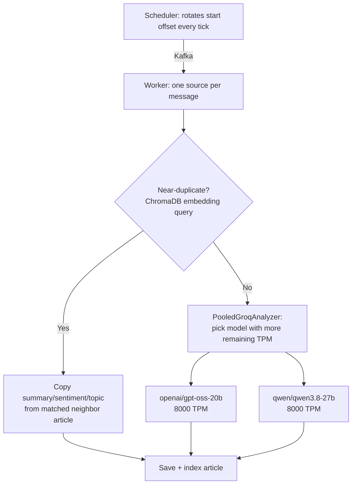
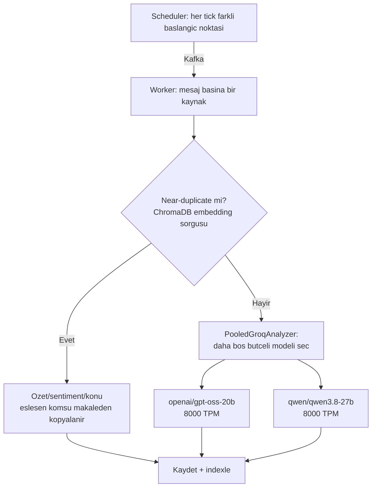

# Groq Rate-Limit Darboğazı — Implementation Plan

> **For agentic workers:** REQUIRED SUB-SKILL: Use superpowers:subagent-driven-development (recommended) or superpowers:executing-plans to implement this plan task-by-task. Steps use checkbox (`- [ ]`) syntax for tracking.

**Goal:** Worker'ın Groq rate-limit'e takılıp registry'nin sonundaki kaynakları
(Guardian Tech/TechCrunch/Hacker News/The Verge) aç bırakmasını üç bağımsız
değişiklikle çözmek: near-duplicate haberler için Groq'u atlamak, ana analiz
trafiğini iki modele (bağımsız TPM havuzları) dinamik dağıtmak, scheduler'ın
kaynakları hep aynı sırayla kuyruklamasını rotasyonla adilleştirmek.

**Architecture:** Üç değişiklik ayrı dosyalarda, ayrı PR'larda, sırayla
uygulanır (near-dup → havuz bölme → rotasyon) — her biri kendi başına
deploy edilip prod'da doğrulanabilir. Mevcut hexagonal katmanlara (port/adapter)
sadık kalınır, yeni bir katman eklenmez.

**Tech Stack:** Python 3.13, FastAPI, pytest, httpx/requests, Groq API
(`openai/gpt-oss-20b` + `qwen/qwen3.8-27b`), ChromaDB, aiokafka, APScheduler.

**Spec:** `docs/superpowers/specs/2026-09-10-groq-darbogazi-design.md`

---

## 🔴 CHECKPOINT (10 Eylül 2026, oturum kota kısıtı nedeniyle burada durduruldu)

**Tamamlanan:**
- **Task 1 (near-dup önceliği) — TAMAMEN BİTTİ.** PR #111 merge edildi, main'e
  deploy oldu, SSM ile canlıda doğrulandı (worker yeni kodla ayakta, hata yok).
- **Task 2 (Task 1 deploy) — TAMAMEN BİTTİ.**
- **Task 3 (havuz bölme kodu: `GroqAnalyzer` model param + `groq_pool.py` +
  `settings.groq_model_pool` + `factory.py`) — TAMAMEN BİTTİ**, tüm testler
  (920/920) yeşil, commit'lendi, PR #112 açıldı, push edildi.

**Yarım kalan:**
- **PR #112 — CI check'leri (test/frontend/security-audit) YEŞİL ama HENÜZ
  MERGE EDİLMEDİ.** Sonraki oturumun İLK işi: `gh pr checks 112` ile tekrar
  doğrula, sorun yoksa `gh pr merge 112 --squash --delete-branch`, sonra
  Task 4'ün geri kalan adımlarını (SSM ile deploy doğrulama — git HEAD
  kontrolü + worker log'unda her iki modelin de (`openai/gpt-oss-20b` VE
  `qwen/qwen3.8-27b`) kullanıldığını gözlemleme) tamamla.
- **Task 5-6 (scheduler rotasyonu) — HİÇ BAŞLANMADI.**
- **Task 7 (öncesi/sonrası ölçüm + README) — HİÇ BAŞLANMADI.** Task 7'nin
  "öncesi" verisi zaten bu plan dosyasında sabit yazılı (7.5dk, 5 haber/3gün,
  8000 TPM) — tekrar ölçmeye gerek yok, sadece Task 4/6 deploy'larından
  sonra "sonrası" verisini toplayıp README'ye işlemek kalıyor.

**Yerel çalışma dizini durumu:** branch `feat/groq-model-pool` üzerinde
(main'den ileride, PR #112 zaten bu dalı origin'e push etmiş durumda —
kod kaybı riski YOK). Sonraki oturum `git checkout main && git pull` ile
başlayıp PR #112'yi merge ettikten sonra devam edebilir.

## Global Constraints

- Test'lerde gerçek API çağrısı yok, her şey mock (CLAUDE.md KODLAMA KURALLARI).
- Exception'ları yut, logla, fallback dön — servis çökmemeli.
- `search_repository=None` / opsiyonel bağımlılık yokken mevcut davranış
  DEĞİŞMEDEN kalmalı (mevcut testler kırılmamalı).
- Import sırası: stdlib → third party → local (`src.*`).
- Commit mesajlarında backtick KULLANMA (Bash `git commit -m` shell
  ikamesi sanıp siler) — tek tırnak kullan.
- Her PR küçük, kısa ömürlü bir feature branch'ten açılır, main'e merge
  sonrası otomatik SSM deploy tetiklenir (`.github/workflows/tests.yml`).
- CI'ın "Health check zaman aşımına uğradı" raporu HOST'un gerçekten
  çöktüğü anlamına gelmez — deploy sonrası SSM ile `docker ps`/`uptime`
  ile MUTLAKA doğrula, sadece CI renginе güvenme (CLAUDE.md BİLİNEN
  NOTLAR — 10 Eylül 2026'da 3. kez yaşandı).

---

## Task 1: Near-duplicate önceliği — dedup kontrolünü Groq'tan önce al

**Files:**
- Modify: `src/adapters/search/chroma_search_repository.py`
- Modify: `src/application/services/news_service.py:158-218` (`update_news_from_source`)
- Test: `tests/adapters/test_semantic_dedup.py`
- Test: `tests/application/test_news_service.py`

**Interfaces:**
- Consumes: mevcut `ChromaSearchRepository.is_near_duplicate(article, threshold=0.92) -> bool` (DOKUNULMAZ, korunur).
- Produces: `ChromaSearchRepository.find_near_duplicate_source(article, threshold=0.92) -> Optional[int]` (eşleşen komşunun `id`'si, yoksa `None`). `NewsService._copy_analysis_from(article: Article, neighbor_id: int) -> bool` (kopyalama başarılıysa `True`, komşu bulunamazsa `False` — çağıran `False` durumunda Groq'a fail-open düşer).

- [x] **Step 1: `find_near_duplicate_source` için başarısız testi yaz**

`tests/adapters/test_semantic_dedup.py` dosyasının SONUNA ekle:

```python
def test_find_near_duplicate_source_returns_neighbor_id():
    repo, _ = make_repo()
    repo._mock_collection.count.return_value = 10
    repo._mock_collection.query.return_value = {
        "ids": [["42"]],
        "distances": [[0.01]],
        "metadatas": [[{"title": "Benzer haber"}]],
    }
    article = make_article(id=None)
    assert repo.find_near_duplicate_source(article, threshold=0.92) == 42


def test_find_near_duplicate_source_returns_none_for_low_similarity():
    repo, _ = make_repo()
    repo._mock_collection.count.return_value = 10
    repo._mock_collection.query.return_value = {
        "ids": [["42"]],
        "distances": [[2.0]],
        "metadatas": [[{"title": "Farklı haber"}]],
    }
    article = make_article(id=None)
    assert repo.find_near_duplicate_source(article, threshold=0.92) is None


def test_find_near_duplicate_source_returns_none_when_collection_empty():
    repo, _ = make_repo()
    repo._mock_collection.count.return_value = 0
    article = make_article(id=None)
    assert repo.find_near_duplicate_source(article, threshold=0.92) is None
```

- [x] **Step 2: Testin doğru sebeple başarısız olduğunu doğrula**

Run: `venv\Scripts\python.exe -m pytest tests/adapters/test_semantic_dedup.py -k find_near_duplicate_source -v`
Expected: FAIL — `AttributeError: 'ChromaSearchRepository' object has no attribute 'find_near_duplicate_source'`

- [x] **Step 3: `find_near_duplicate_source`'ı uygula**

`src/adapters/search/chroma_search_repository.py`'de `is_near_duplicate`
metodunun HEMEN ALTINA ekle (mevcut `is_near_duplicate` DOKUNULMADAN kalır):

```python
    def find_near_duplicate_source(self, article: Article, threshold: float = 0.92) -> Optional[int]:
        """is_near_duplicate ile AYNI sorgu/eşik, ama eşleşirse komşunun id'sini
        döner (None = near-duplicate değil). Groq analizinden ÖNCE çağrılabilsin
        diye ayrı bir metod — update_news_from_source bu id ile komşunun zaten
        var olan analizini kopyalar, Groq'a hiç gitmez (bkz. spec, 10 Eyl 2026)."""
        try:
            if self.collection.count() == 0:
                return None
            text = self._article_embedding_text(article)
            embedding = self.embedder.embed_text(text)
            results = self.collection.query(
                query_embeddings=[embedding],
                n_results=1,
            )
            if not results["ids"][0]:
                return None
            distance = results["distances"][0][0]
            similarity = 1 / (1 + distance)
            if similarity < threshold:
                return None
            return int(results["ids"][0][0])
        except Exception as e:
            logger.warning("Near-duplicate kaynak sorgusu başarısız: %s", e)
            return None
```

Dosyanın en üstündeki import satırına `Optional` ekle (yoksa):
```python
from typing import Optional
```

- [x] **Step 4: Testin geçtiğini doğrula**

Run: `venv\Scripts\python.exe -m pytest tests/adapters/test_semantic_dedup.py -v`
Expected: PASS (yeni 3 test + mevcut `is_near_duplicate` testleri hepsi yeşil)

- [x] **Step 5: Commit**

```bash
git add src/adapters/search/chroma_search_repository.py tests/adapters/test_semantic_dedup.py
git commit -m 'feat(search): find_near_duplicate_source ekle - komsu id dondurur'
```

- [x] **Step 6: `NewsService`'e `_copy_analysis_from` için başarısız testi yaz**

`tests/application/test_news_service.py`'nin sonuna (mevcut `make_article`/
`make_service` yardımcılarını kullanarak) ekle:

```python
def test_near_duplicate_skips_groq_and_copies_neighbor_analysis():
    """Near-duplicate çıkan haber Groq'a HİÇ gitmemeli, analiz alanları
    komşudan kopyalanmalı (spec: 10 Eylül 2026, near-dup önceliği)."""
    mock_repo = MagicMock()
    mock_repo.bulk_exists.return_value = set()
    mock_repo.save_article.return_value = True
    neighbor = Article(
        id=42, title="Komşu haber", source="AA", url="https://aa.com.tr/x",
        content="...", summary="Komşunun özeti", sentiment_score=0.5,
        sentiment_label="Positive", entities={"persons": ["X"]}, topic="Politics",
    )
    mock_repo.get_article_by_id.return_value = neighbor
    mock_analyzer = MagicMock()
    mock_search = MagicMock()
    mock_search.find_near_duplicate_source.return_value = 42

    service = NewsService(repository=mock_repo, analyzer=mock_analyzer, search_repository=mock_search)
    mock_scraper = MagicMock()
    mock_scraper.fetch_news = AsyncMock(return_value=[make_article()])

    asyncio.run(service.update_news_from_source(mock_scraper))

    mock_analyzer.analyze_text.assert_not_called()
    saved = mock_repo.save_article.call_args[0][0]
    assert saved.is_duplicate is True
    assert saved.summary == "Komşunun özeti"
    assert saved.sentiment_label == "Positive"
    assert saved.topic == "Politics"
    assert saved.entities == {"persons": ["X"]}


def test_non_duplicate_still_calls_groq():
    """Near-duplicate DEĞİLSE eski akış (Groq çağrısı) aynen çalışmalı."""
    mock_repo = MagicMock()
    mock_repo.bulk_exists.return_value = set()
    mock_repo.save_article.return_value = True
    mock_analyzer = MagicMock()
    mock_analyzer.analyze_text.return_value = {
        "sentiment_score": 0.8, "sentiment_label": "Positive",
        "summary": "Good news today", "entities": {}, "topic": "Other",
    }
    mock_search = MagicMock()
    mock_search.find_near_duplicate_source.return_value = None

    service = NewsService(repository=mock_repo, analyzer=mock_analyzer, search_repository=mock_search)
    mock_scraper = MagicMock()
    mock_scraper.fetch_news = AsyncMock(return_value=[make_article()])

    asyncio.run(service.update_news_from_source(mock_scraper))

    mock_analyzer.analyze_text.assert_called_once()
    saved = mock_repo.save_article.call_args[0][0]
    assert saved.is_duplicate is False


def test_near_duplicate_falls_back_to_groq_when_neighbor_missing():
    """Komşu id bulunuyor ama DB'den çekilemiyorsa (silinmiş/hata) Groq'a
    fail-open düşülmeli — sessizce boş kart üretilmemeli."""
    mock_repo = MagicMock()
    mock_repo.bulk_exists.return_value = set()
    mock_repo.save_article.return_value = True
    mock_repo.get_article_by_id.return_value = None
    mock_analyzer = MagicMock()
    mock_analyzer.analyze_text.return_value = {
        "sentiment_score": 0.0, "sentiment_label": "Neutral",
        "summary": "Fallback", "entities": {}, "topic": "Other",
    }
    mock_search = MagicMock()
    mock_search.find_near_duplicate_source.return_value = 999

    service = NewsService(repository=mock_repo, analyzer=mock_analyzer, search_repository=mock_search)
    mock_scraper = MagicMock()
    mock_scraper.fetch_news = AsyncMock(return_value=[make_article()])

    asyncio.run(service.update_news_from_source(mock_scraper))

    mock_analyzer.analyze_text.assert_called_once()
```

- [x] **Step 7: Testlerin doğru sebeple başarısız olduğunu doğrula**

Run: `venv\Scripts\python.exe -m pytest tests/application/test_news_service.py -k "near_duplicate or non_duplicate_still" -v`
Expected: FAIL — `mock_analyzer.analyze_text.assert_not_called()` başarısız
(çünkü `update_news_from_source` hâlâ her makaleyi analiz ediyor,
`find_near_duplicate_source` hiç çağrılmıyor).

- [x] **Step 8: `update_news_from_source`'u yeniden sırala + `_copy_analysis_from` ekle**

`src/application/services/news_service.py`'de `update_news_from_source`
içindeki döngüyü (satır ~184-199) şununla DEĞİŞTİR:

```python
        for i, article in enumerate(new_articles):
            if i > 0:
                await asyncio.sleep(settings.groq_request_interval_seconds)  # Groq TPM limitini aşmamak için throttle

            neighbor_id = None
            if self.search_repository:
                try:
                    neighbor_id = self.search_repository.find_near_duplicate_source(article)
                except Exception as e:
                    logger.warning("Dedup kontrolü başarısız, devam ediliyor: %s", e)

            copied = False
            if neighbor_id is not None:
                copied = self._copy_analysis_from(article, neighbor_id)

            if not copied:
                result = await loop.run_in_executor(None, self.analyzer.analyze_text, article.content)
                self._apply_analysis(article, result)

            try:
                self._enrich_metadata(article)
            except Exception as e:
                logger.warning("Metadata zenginleştirme başarısız, devam ediliyor: %s", e)
```

Bu bloktan SONRAKİ kısım (`saved = self.repository.save_article(article)`
ve devamı) AYNEN kalır — sadece eski `is_near_duplicate` çağrısı ve
üstündeki `if self.search_repository: try: article.is_duplicate = ...`
bloğu yukarıdaki yeni blokla değiştirilmiş oluyor (eski blok SİLİNİR).

`_apply_analysis`'in HEMEN ÜSTÜNE (satır ~140 civarı) yeni metodu ekle:

```python
    def _copy_analysis_from(self, article: Article, neighbor_id: int) -> bool:
        """Near-duplicate çıkan bir makalenin analiz alanlarını, ChromaDB'nin
        zaten bulduğu en yakın komşudan kopyalar — Groq'a hiç gitmeden.
        Komşu DB'den çekilemezse (silinmiş/hata) False döner, çağıran Groq'a
        fail-open düşer (nötr/boş kart üretilmesin diye)."""
        try:
            neighbor = self.repository.get_article_by_id(neighbor_id)
        except Exception as e:
            logger.warning("Near-duplicate komşusu okunamadı (id=%s): %s", neighbor_id, e)
            return False
        if neighbor is None:
            return False
        article.is_duplicate = True
        article.summary = neighbor.summary
        article.sentiment_score = neighbor.sentiment_score
        article.sentiment_label = neighbor.sentiment_label
        article.entities = neighbor.entities
        article.topic = neighbor.topic
        return True
```

- [x] **Step 9: Testlerin geçtiğini doğrula**

Run: `venv\Scripts\python.exe -m pytest tests/application/test_news_service.py -v`
Expected: PASS (yeni 3 test + mevcut TÜM testler, hiçbiri kırılmamış olmalı)

- [x] **Step 10: Tam test paketini çalıştır**

Run: `venv\Scripts\python.exe -m pytest tests/ -q`
Expected: hepsi yeşil (mevcut sayı + 6 yeni test)

- [x] **Step 11: Commit**

```bash
git add src/application/services/news_service.py tests/application/test_news_service.py
git commit -m 'feat(news): near-duplicate haberler Groq yerine komsudan analiz kopyalar'
```

---

## Task 2: Task 1'i deploy et ve doğrula

**Files:** yok (sadece git/CI/SSM işlemleri)

- [x] **Step 1: Feature branch aç, push et**

```bash
git checkout -b feat/near-dup-before-groq
git push -u origin feat/near-dup-before-groq
```

(Task 1'in commit'leri zaten bu branch'e gitmiş olmalı — eğer main
üzerinde yapıldıysa önce `git checkout -b feat/near-dup-before-groq` ile
dalı oluştur, sonra push et.)

- [x] **Step 2: PR aç**

```bash
gh pr create --title "feat(news): near-duplicate haberler Groq yerine komsudan analiz kopyalar" --body "Spec: docs/superpowers/specs/2026-09-10-groq-darbogazi-design.md (Bolum 3). Near-duplicate kontrolu Groq analizinden ONCEye alindi - near-dup cikan haberler Groq'a gitmiyor, analiz alanlari ChromaDB'nin buldugu en yakin komsudan kopyalaniyor. Test: 6 yeni test, tam suite yesil." --base main
```

- [x] **Step 3: CI'ın geçmesini bekle**

```bash
gh pr checks <PR_NUMBER> --watch --interval 15
```

Expected: `test`, `frontend`, `security-audit` hepsi `pass`.

- [x] **Step 4: Merge et**

```bash
gh pr merge <PR_NUMBER> --squash --delete-branch
git checkout main
git pull --ff-only
```

- [x] **Step 5: Deploy'un tamamlanmasını izle, CI "health check timeout" derse SSM ile doğrula**

```bash
gh run list --branch main --limit 1 --json databaseId,status
gh run watch <RUN_ID> --interval 20
```

CI "Health check zaman aşımına uğradı" derse (Global Constraints'teki
bilinen gotcha), SSM ile doğrula:

```bash
aws ssm send-command --instance-ids "i-0608c897a3d8ca3f3" --document-name "AWS-RunShellScript" --parameters '{"commands":["export HOME=/home/ubuntu","cd ~/NexStream-News-Engine","git -c safe.directory=/home/ubuntu/NexStream-News-Engine log -1 --format=%H_%ci_%s","docker ps --format table_{{.Names}}_{{.Status}}"]}' --output json
```

`aws ssm get-command-invocation --command-id <ID> --instance-id "i-0608c897a3d8ca3f3" --output text --query "StandardOutputContent"`
ile sonucu oku — git HEAD'in merge commit'i gösterdiğini ve tüm
container'ların `Up`/`healthy` olduğunu doğrula.

- [x] **Step 6: Prod'da gerçekten çalıştığını worker log'undan doğrula**

```bash
aws ssm send-command --instance-ids "i-0608c897a3d8ca3f3" --document-name "AWS-RunShellScript" --parameters '{"commands":["docker logs nexstream_worker --since 15m 2>&1 | grep -i duplicate | tail -20"]}' --output json
```

Bir süre (bir sonraki 10dk'lık scheduler tick'i) sonra `get-command-invocation`
ile çıktıyı oku — `is_duplicate` işaretlenen bir haber görürsen (veya en
azından hata yoksa) fix canlıda çalışıyor demektir. Görmezsen endişelenme,
near-duplicate oranı düşük olabilir — Task 7'de daha uzun bir pencerede
tekrar bakılacak.

---

## Task 3: Havuz bölme — `PooledGroqAnalyzer`

**Files:**
- Modify: `src/adapters/analysis/groq_analyzer.py`
- Create: `src/adapters/analysis/groq_pool.py`
- Modify: `src/adapters/analysis/factory.py`
- Modify: `src/infrastructure/config/settings.py`
- Test: `tests/adapters/test_groq_analyzer.py`
- Test: `tests/adapters/test_groq_pool.py` (yeni)

**Interfaces:**
- Consumes: `AnalysisPort.analyze_text(text: str) -> dict` (mevcut sözleşme, değişmez).
- Produces: `GroqAnalyzer(model: str = "openai/gpt-oss-20b")` (artık gerçek parametre). `groq_pool.record_remaining(model: str, remaining: int) -> None`, `groq_pool.pick_least_loaded(models: list[str]) -> str`. `PooledGroqAnalyzer(models: list[str])` — `AnalysisPort` uygular. `settings.groq_model_pool: str`.

- [x] **Step 1: `GroqAnalyzer`'ın model parametresini kabul ettiğini doğrulayan test yaz**

`tests/adapters/test_groq_analyzer.py`'nin sonuna ekle:

```python
def test_analyzer_uses_configured_model_in_request():
    """model parametresi verilirse Groq'a giden payload'da o model kullanılmalı."""
    analyzer = GroqAnalyzer(model="qwen/qwen3.8-27b")
    response_json = '{"sentiment_score": 0.0, "sentiment_label": "Neutral", "summary": "ok"}'

    with patch("requests.post", return_value=make_mock_response(response_json)) as mock_post:
        analyzer.analyze_text("test content")

    sent_payload = mock_post.call_args.kwargs["json"]
    assert sent_payload["model"] == "qwen/qwen3.8-27b"


def test_analyzer_default_model_unchanged():
    """Parametre verilmezse eski davranış (gpt-oss-20b) korunmalı."""
    analyzer = GroqAnalyzer()
    assert analyzer.model == "openai/gpt-oss-20b"
```

- [x] **Step 2: Testin durumunu doğrula**

Run: `venv\Scripts\python.exe -m pytest tests/adapters/test_groq_analyzer.py -k "configured_model or default_model_unchanged" -v`
Expected: `test_analyzer_default_model_unchanged` zaten PASS olabilir (mevcut
kod zaten `self.model = "openai/gpt-oss-20b"` hardcoded ama `__init__`
parametre almıyor) — `test_analyzer_uses_configured_model_in_request` FAIL
olmalı: `TypeError: __init__() takes 1 positional argument but ... model ...`

- [x] **Step 3: `GroqAnalyzer.__init__`'i parametrik yap**

`src/adapters/analysis/groq_analyzer.py`'de:

```python
    def __init__(self, model: str = "openai/gpt-oss-20b"):
        self.api_key = settings.groq_api_key
        self.model = model
        self.api_url = "https://api.groq.com/openai/v1/chat/completions"
```

- [x] **Step 4: Testlerin geçtiğini doğrula**

Run: `venv\Scripts\python.exe -m pytest tests/adapters/test_groq_analyzer.py -v`
Expected: PASS (tüm dosya, mevcut testler dahil — `GroqAnalyzer()` varsayılanı hâlâ `gpt-oss-20b`)

- [x] **Step 5: Commit**

```bash
git add src/adapters/analysis/groq_analyzer.py tests/adapters/test_groq_analyzer.py
git commit -m 'feat(analysis): GroqAnalyzer model parametrik hale getirildi'
```

- [x] **Step 6: `groq_pool` modülü için başarısız test yaz**

`tests/adapters/test_groq_pool.py` (yeni dosya):

```python
from unittest.mock import MagicMock, patch
from src.adapters.analysis import groq_pool
from src.adapters.analysis.groq_pool import PooledGroqAnalyzer, pick_least_loaded, record_remaining


def setup_function(_):
    # Modül seviyesi paylaşılan durum testler arasında sızmasın diye sıfırla.
    groq_pool._remaining_tokens.clear()


def test_pick_least_loaded_prefers_higher_remaining():
    record_remaining("model-a", 500)
    record_remaining("model-b", 7000)
    assert pick_least_loaded(["model-a", "model-b"]) == "model-b"


def test_pick_least_loaded_prefers_never_called_model():
    record_remaining("model-a", 500)
    # "model-b" hiç çağrılmadı -> tam bütçeli sayılır, önce o denenir
    assert pick_least_loaded(["model-a", "model-b"]) == "model-b"


def test_pooled_analyzer_delegates_to_least_loaded_model():
    record_remaining("openai/gpt-oss-20b", 100)
    record_remaining("qwen/qwen3.8-27b", 7000)

    pooled = PooledGroqAnalyzer(["openai/gpt-oss-20b", "qwen/qwen3.8-27b"])
    mock_result = {"sentiment_score": 0.0, "sentiment_label": "Neutral", "summary": "ok", "entities": {}, "topic": "Other"}
    for analyzer in pooled._analyzers.values():
        analyzer.analyze_text = MagicMock(return_value=mock_result)

    result = pooled.analyze_text("test content")

    pooled._analyzers["qwen/qwen3.8-27b"].analyze_text.assert_called_once_with("test content")
    pooled._analyzers["openai/gpt-oss-20b"].analyze_text.assert_not_called()
    assert result == mock_result


def test_record_remaining_is_thread_safe_under_concurrent_writes():
    import threading
    def writer(model, value):
        for _ in range(100):
            record_remaining(model, value)
    threads = [threading.Thread(target=writer, args=(f"model-{i}", i)) for i in range(10)]
    for t in threads:
        t.start()
    for t in threads:
        t.join()
    for i in range(10):
        assert groq_pool._remaining_tokens[f"model-{i}"] == i
```

- [x] **Step 7: Testin doğru sebeple başarısız olduğunu doğrula**

Run: `venv\Scripts\python.exe -m pytest tests/adapters/test_groq_pool.py -v`
Expected: FAIL — `ModuleNotFoundError: No module named 'src.adapters.analysis.groq_pool'`

- [x] **Step 8: `groq_pool.py`'ı uygula**

`src/adapters/analysis/groq_pool.py` (yeni dosya):

```python
"""Groq ana analiz pipeline'ı için havuz bölme — TPM darboğazını iki bağımsız
model kovasına dağıtır (spec: docs/superpowers/specs/2026-09-10-groq-darbogazi-design.md).

10 Eylül 2026'da canlıda ölçüldü: openai/gpt-oss-20b TEK BAŞINA 17 kaynağın
trafiğini karşılayamıyordu (TPM=8000, tek bir istek 184s'lik proaktif
beklemeye takıldı). qwen/qwen3.8-27b AYRI bir 8000 TPM kovasına sahip
(gerçek Groq header'larıyla doğrulandı) ve gpt-oss ailesi gibi content/
reasoning ayrımı temiz (qwen3.6-27b'nin aksine - o <think> etiketini content
içine gömüyor, KULLANILMADI).

Kaynak->model statik ataması YOK: her çağrıda hangi modelin bütçesi daha
rahatsa oraya gidilir (GroqAnalyzer'ın zaten okuduğu x-ratelimit-remaining-
tokens header'ının doğal bir uzantısı). Yeni bir kaynak eklenince hiçbir ek
karar/config gerekmez.
"""

import threading
from typing import Optional
from src.domain.ports.analysis_port import AnalysisPort
from src.adapters.analysis.groq_analyzer import GroqAnalyzer

_budget_lock = threading.Lock()
_remaining_tokens: dict[str, int] = {}  # model adı -> son bilinen kalan TPM


def record_remaining(model: str, remaining: int) -> None:
    """GroqAnalyzer her Groq yanıtından sonra bu modelin kalan TPM bütçesini
    buraya yazar (thread-safe - worker çağrıları run_in_executor thread
    pool'unda çalışıyor)."""
    with _budget_lock:
        _remaining_tokens[model] = remaining


def pick_least_loaded(models: list[str]) -> str:
    """Hiç çağrılmamış model tam bütçeli (sonsuz) sayılır - önce o denenir."""
    with _budget_lock:
        return max(models, key=lambda m: _remaining_tokens.get(m, float("inf")))


class PooledGroqAnalyzer(AnalysisPort):
    def __init__(self, models: list[str]):
        self._analyzers: dict[str, GroqAnalyzer] = {m: GroqAnalyzer(model=m) for m in models}

    def analyze_text(self, text: str) -> dict:
        model = pick_least_loaded(list(self._analyzers))
        return self._analyzers[model].analyze_text(text)
```

`src/adapters/analysis/groq_analyzer.py`'de `_throttle_for_remaining_budget`
metodunun İÇİNE, `remaining` hesaplandıktan hemen sonra (mevcut `if remaining
>= self._TOKEN_SAFETY_MARGIN: return` satırından ÖNCE) tek satır ekle:

```python
        remaining_raw = headers.get("x-ratelimit-remaining-tokens")
        if not isinstance(remaining_raw, str):
            return
        try:
            remaining = int(remaining_raw)
        except ValueError:
            return
        from src.adapters.analysis.groq_pool import record_remaining
        record_remaining(self.model, remaining)
        if remaining >= self._TOKEN_SAFETY_MARGIN:
            return
```

(Import fonksiyon içinde — dosya başına taşımak `groq_pool.py`'ın
`groq_analyzer.py`'ı import etmesiyle dairesel import yaratır, bu yüzden
lazy import bilinçli tercih.)

- [x] **Step 9: Testlerin geçtiğini doğrula**

Run: `venv\Scripts\python.exe -m pytest tests/adapters/test_groq_pool.py tests/adapters/test_groq_analyzer.py -v`
Expected: PASS (tüm testler)

- [x] **Step 10: Commit**

```bash
git add src/adapters/analysis/groq_pool.py src/adapters/analysis/groq_analyzer.py tests/adapters/test_groq_pool.py
git commit -m 'feat(analysis): PooledGroqAnalyzer - en bos butceli modele dinamik dagitim'
```

- [x] **Step 11: `settings.groq_model_pool` için başarısız test yaz**

`tests/infrastructure/test_settings.py` (mevcut dosya) sonuna ekle:

```python
def test_groq_model_pool_default():
    from src.infrastructure.config.settings import Settings
    s = Settings()
    assert s.groq_model_pool == "openai/gpt-oss-20b,qwen/qwen3.8-27b"
```

- [x] **Step 12: Testin durumunu doğrula**

Run: `venv\Scripts\python.exe -m pytest tests/infrastructure/test_settings.py -k groq_model_pool -v`
Expected: FAIL — `AttributeError` (alan henüz yok)

- [x] **Step 13: `settings.py`'ye alanı ekle**

`src/infrastructure/config/settings.py`'de `groq_request_interval_seconds`
satırının HEMEN ALTINA ekle:

```python
    # Ana analiz pipeline'ının dağıtıldığı Groq modelleri (virgülle ayrılmış).
    # Her modelin TPM kovası BAĞIMSIZ (10 Eyl 2026 canlı ölçümle doğrulandı,
    # ikisi de 8000 TPM) - tek modelin tüm 17 kaynağı karşılayamaması
    # (bkz. groq_pool.py docstring) buradan çözülür. Kaynak->model statik
    # ataması YOK, PooledGroqAnalyzer her çağrıda dinamik seçer. qwen/
    # qwen3.6-27b BİLİNÇLİ OLARAK YOK - content içine <think> gömüyor,
    # mevcut JSON parser'ı kırar (eski llama-3.1-8b-instant felaketiyle aynı
    # sınıf hata). Tek eleman verilirse eski tek-model davranışı korunur.
    groq_model_pool: str = "openai/gpt-oss-20b,qwen/qwen3.8-27b"
```

- [x] **Step 14: Testin geçtiğini doğrula**

Run: `venv\Scripts\python.exe -m pytest tests/infrastructure/test_settings.py -k groq_model_pool -v`
Expected: PASS

- [x] **Step 15: Commit**

```bash
git add src/infrastructure/config/settings.py tests/infrastructure/test_settings.py
git commit -m 'feat(config): groq_model_pool env var eklendi'
```

- [x] **Step 16: `factory.build_analyzer()` için başarısız test yaz**

`tests/adapters/test_analysis_factory.py` (yeni dosya — `test_query_
expander_factory.py` ile aynı isimlendirme deseni):

```python
from src.adapters.analysis.factory import build_analyzer
from src.adapters.analysis.groq_pool import PooledGroqAnalyzer
from src.adapters.analysis.fallback_analyzer import FallbackAnalyzer


def test_build_analyzer_uses_pooled_groq():
    result = build_analyzer()

    assert isinstance(result, FallbackAnalyzer)
    assert isinstance(result.analyzers[0], PooledGroqAnalyzer)
    assert set(result.analyzers[0]._analyzers.keys()) == {"openai/gpt-oss-20b", "qwen/qwen3.8-27b"}
```

(`FallbackAnalyzer.analyzers` doğrulandı — gerçek attribute adı `self.
analyzers`, düz liste, bu isimle kullanılıyor.)

- [x] **Step 17: Testin doğru sebeple başarısız olduğunu doğrula**

Run: `venv\Scripts\python.exe -m pytest tests/adapters/test_analysis_factory.py -v`
Expected: FAIL (henüz `PooledGroqAnalyzer` kullanılmıyor, `analyzers[0]` hâlâ düz `GroqAnalyzer`)

- [x] **Step 18: `factory.py`'ı güncelle**

`src/adapters/analysis/factory.py`'de importlara ekle:

```python
from src.adapters.analysis.groq_pool import PooledGroqAnalyzer
```

`build_analyzer` fonksiyonunu şununla değiştir:

```python
def build_analyzer() -> AnalysisPort:
    models = [m.strip() for m in settings.groq_model_pool.split(",") if m.strip()]
    analyzers = [PooledGroqAnalyzer(models)]
    if settings.huggingface_api_key:
        analyzers.append(HuggingFaceAnalyzer())
    return FallbackAnalyzer(analyzers)
```

- [x] **Step 19: Testlerin geçtiğini doğrula**

Run: `venv\Scripts\python.exe -m pytest tests/adapters/test_analysis_factory.py -v`
Expected: PASS

- [x] **Step 20: Tam test paketini çalıştır**

Run: `venv\Scripts\python.exe -m pytest tests/ -q`
Expected: hepsi yeşil

- [x] **Step 21: Commit**

```bash
git add src/adapters/analysis/factory.py tests/adapters/test_analysis_factory.py
git commit -m 'feat(analysis): build_analyzer artik PooledGroqAnalyzer kullaniyor'
```

---

## Task 4: Task 3'ü deploy et ve doğrula

**Files:** yok (sadece git/CI/SSM işlemleri)

- [ ] **Step 1: Feature branch aç (veya mevcut dalı kullan), push et**

```bash
git checkout -b feat/groq-model-pool
git push -u origin feat/groq-model-pool
```

- [ ] **Step 2: PR aç**

```bash
gh pr create --title "feat(analysis): Groq ana pipeline iki modele dinamik dagitiliyor" --body "Spec: docs/superpowers/specs/2026-09-10-groq-darbogazi-design.md (Bolum 1). PooledGroqAnalyzer, her cagrida hangi modelin (gpt-oss-20b / qwen3.8-27b) TPM butcesi daha rahatsa oraya gidiyor - kaynak->model statik atamasi yok. 10 Eyl 2026 canli olcumle dogrulandi: iki model bagimsiz 8000 TPM kovasina sahip." --base main
```

- [ ] **Step 3: CI'ı izle, merge et**

```bash
gh pr checks <PR_NUMBER> --watch --interval 15
gh pr merge <PR_NUMBER> --squash --delete-branch
git checkout main
git pull --ff-only
```

- [ ] **Step 4: Deploy'u SSM ile doğrula (Task 2 Step 5'teki gotcha aynen geçerli)**

```bash
aws ssm send-command --instance-ids "i-0608c897a3d8ca3f3" --document-name "AWS-RunShellScript" --parameters '{"commands":["docker exec nexstream_worker grep -A2 groq_model_pool /app/src/infrastructure/config/settings.py"]}' --output json
```

`get-command-invocation` ile çıktının yeni `groq_model_pool` satırını
içerdiğini doğrula.

- [ ] **Step 5: Worker log'unda gerçekten iki modelin de kullanıldığını doğrula**

Bir sonraki scheduler tick'inden (10dk) sonra:

```bash
aws ssm send-command --instance-ids "i-0608c897a3d8ca3f3" --document-name "AWS-RunShellScript" --parameters '{"commands":["docker logs nexstream_worker --since 20m 2>&1 | grep -oE \"qwen/qwen3.8-27b|openai/gpt-oss-20b\" | sort | uniq -c"]}' --output json
```

Her iki modelin de en az bir kez göründüğünü doğrula (tek model hâlâ
görünüyorsa `factory.py`'nin deploy'da güncellenip güncellenmediğini
Step 4'teki gibi tekrar kontrol et).

---

## Task 5: Scheduler rotasyonu

**Files:**
- Modify: `src/adapters/scheduling/scheduler_service.py`
- Test: `tests/adapters/test_scheduler_service.py` (yoksa yeni oluştur)

**Interfaces:**
- Consumes: `settings.scrape_sources: str` (mevcut, değişmez).
- Produces: `send_scrape_command()` artık her çağrıda farklı bir sırayla kaynak yayınlar (dışarıya görünen imza değişmez, iç davranış değişir).

- [ ] **Step 1: Rotasyon için başarısız test yaz**

`tests/adapters/test_scheduler_service.py` bulunamazsa yeni oluştur:

```python
import asyncio
from unittest.mock import AsyncMock, patch
import src.adapters.scheduling.scheduler_service as sched


def setup_function(_):
    sched._tick_index = 0


def test_send_scrape_command_rotates_start_each_tick():
    sched.producer = AsyncMock()
    with patch("src.adapters.scheduling.scheduler_service.settings") as mock_settings:
        mock_settings.scrape_sources = "A,B,C"

        asyncio.run(sched.send_scrape_command())
        first_order = [call.args[1] for call in sched.producer.send_and_wait.call_args_list]

        sched.producer.reset_mock()
        asyncio.run(sched.send_scrape_command())
        second_order = [call.args[1] for call in sched.producer.send_and_wait.call_args_list]

    assert first_order != second_order


def test_send_scrape_command_never_drops_or_duplicates_sources():
    import json
    sched.producer = AsyncMock()
    with patch("src.adapters.scheduling.scheduler_service.settings") as mock_settings:
        mock_settings.scrape_sources = "A,B,C"

        asyncio.run(sched.send_scrape_command())
        sent = [json.loads(call.args[1])["source"] for call in sched.producer.send_and_wait.call_args_list]

    assert sorted(sent) == ["A", "B", "C"]
```

- [ ] **Step 2: Testin doğru sebeple başarısız olduğunu doğrula**

Run: `venv\Scripts\python.exe -m pytest tests/adapters/test_scheduler_service.py -v`
Expected: `test_send_scrape_command_rotates_start_each_tick` FAIL (iki çağrı
şu an AYNI sırayı üretiyor, `_tick_index` diye bir şey yok — muhtemelen
`AttributeError` veya `first_order == second_order` assertion hatası).

- [ ] **Step 3: Rotasyonu uygula**

`src/adapters/scheduling/scheduler_service.py`'de `producer` satırının
altına modül seviyesi sayaç ekle:

```python
producer: AIOKafkaProducer = None
_tick_index = 0
```

`send_scrape_command`'ı şununla değiştir:

```python
async def send_scrape_command():
    global _tick_index
    sources = [s.strip() for s in settings.scrape_sources.split(",") if s.strip()]
    if sources:
        offset = _tick_index % len(sources)
        sources = sources[offset:] + sources[:offset]
        _tick_index += 1
    for source in sources:
        try:
            command = {"source": source, "action": "scrape"}
            await producer.send_and_wait(TOPIC_NAME, json.dumps(command).encode())
            logger.info("Scrape emri gönderildi: %s", source)
        except Exception as e:
            logger.error("Scrape emri gönderilemedi (%s): %s", source, e)
```

- [ ] **Step 4: Testlerin geçtiğini doğrula**

Run: `venv\Scripts\python.exe -m pytest tests/adapters/test_scheduler_service.py -v`
Expected: PASS

- [ ] **Step 5: Tam test paketini çalıştır**

Run: `venv\Scripts\python.exe -m pytest tests/ -q`
Expected: hepsi yeşil

- [ ] **Step 6: Commit**

```bash
git add src/adapters/scheduling/scheduler_service.py tests/adapters/test_scheduler_service.py
git commit -m 'feat(scheduler): kaynak siralamasi her tick de rotasyonla degisir'
```

---

## Task 6: Task 5'i deploy et ve doğrula

**Files:** yok (sadece git/CI/SSM işlemleri)

- [ ] **Step 1: Feature branch aç, push et, PR aç**

```bash
git checkout -b feat/scheduler-rotation
git push -u origin feat/scheduler-rotation
gh pr create --title "feat(scheduler): kaynak siralamasi rotasyonla adil hale getirildi" --body "Spec: docs/superpowers/specs/2026-09-10-groq-darbogazi-design.md (Bolum 2). scheduler_service artik her tick'te farkli bir baslangic noktasindan yayinliyor - worker geride kalsa bile hicbir kaynak surekli son sirada kalamaz." --base main
```

- [ ] **Step 2: CI'ı izle, merge et**

```bash
gh pr checks <PR_NUMBER> --watch --interval 15
gh pr merge <PR_NUMBER> --squash --delete-branch
git checkout main
git pull --ff-only
```

- [ ] **Step 3: Deploy'u SSM ile doğrula, scheduler log'unda rotasyonu gözle**

```bash
aws ssm send-command --instance-ids "i-0608c897a3d8ca3f3" --document-name "AWS-RunShellScript" --parameters '{"commands":["docker logs nexstream_scheduler --since 25m 2>&1 | grep \"Scrape emri gönderildi\" | head -40"]}' --output json
```

`get-command-invocation` ile en az iki tick'in (art arda iki 17-satırlık
blok) FARKLI bir kaynaktan başladığını gözle doğrula.

---

## Task 7: Öncesi/sonrası ölçüm + README dokümantasyonu

**Files:**
- Modify: `README.md:161` (EN, "How It Works — Scoring & Search Algorithms" bölümünün altına yeni alt başlık)
- Modify: `README.md:670` (TR, "Nasıl Çalışır — Skorlama & Arama Algoritmaları" bölümünün altına yeni alt başlık)

**Interfaces:** yok (sadece dokümantasyon).

- [ ] **Step 1: "Öncesi" verisini bu oturumdan topla (zaten ölçüldü, tekrar ölçmeye gerek yok)**

Bu plandan önceki oturumda gerçek ölçüldü, README'ye aynen taşınacak:
- TRT Haber'in (1. sıradaki kaynak) 3 yeni haberini bitirmesi: **7.5 dakika**
  (tek bir Groq beklemesi 184 saniye).
- Guardian Tech / TechCrunch / Hacker News / The Verge (registry'de son 4
  kaynak): **5 haber / 3 gün** (diğer kaynaklar 35-240 arası).
- `openai/gpt-oss-20b` TPM tavanı: **8000 token/dakika**, TEK BAŞINA 17
  kaynağın trafiğini karşılayamıyordu.

- [ ] **Step 2: "Sonrası" verisini prod'dan topla (Task 6 deploy'undan EN AZ 24 saat sonra çalıştır)**

Kaynak trafiği (Task 1 öncesi ölçümle aynı sorgu, karşılaştırılabilir olsun diye):

```bash
aws ssm send-command --instance-ids "i-0608c897a3d8ca3f3" --document-name "AWS-RunShellScript" --parameters '{"commands":["docker exec nexstream_db psql -U nexstream -d nexstream -t -c \"SELECT source, count(*) FROM news_articles WHERE created_at > now() - interval '\''3 days'\'' GROUP BY source ORDER BY count(*) DESC;\""]}' --output json
```

`get-command-invocation` ile sonucu oku, özellikle Guardian Tech/TechCrunch/
Hacker News/The Verge'in yeni sayılarını not et.

Bir kaynağın tam işlenme süresi (worker log'undan "Güncelleme başladı" →
"Güncelleme bitti" arası, TRT Haber için):

```bash
aws ssm send-command --instance-ids "i-0608c897a3d8ca3f3" --document-name "AWS-RunShellScript" --parameters '{"commands":["docker logs nexstream_worker --since 6h 2>&1 | grep -E \"Güncelleme (başladı|bitti): TRTHaberScraper\" | tail -10"]}' --output json
```

İki ardışık "başladı"/"bitti" satırının timestamp farkını hesapla.

Havuz dağılımı (her iki modelin de gerçekten kullanıldığını sayısal olarak göster):

```bash
aws ssm send-command --instance-ids "i-0608c897a3d8ca3f3" --document-name "AWS-RunShellScript" --parameters '{"commands":["docker logs nexstream_worker --since 24h 2>&1 | grep -oE \"qwen/qwen3.8-27b|openai/gpt-oss-20b\" | sort | uniq -c"]}' --output json
```

- [ ] **Step 3: README'nin İngilizce bölümüne yeni alt başlık ekle**

`README.md`'de `### News Sources (17)` başlığının (satır ~239) HEMEN
ÜSTÜNE, `### How It Works — Scoring & Search Algorithms` bölümünün
devamı olarak yeni bir `####` alt başlık ekle:

```markdown
#### News Analysis Pipeline & Groq Rate-Limit Handling

The worker processes 17 sources through a shared Groq LLM budget. Early
production data (Sep 2026) showed a single busy source could exhaust the
pipeline: a Groq TPM (tokens-per-minute) cap of 8000 on one model meant
sources queued last (by a fixed schedule order) went starved for days.

Three independent fixes address this:



**Before / after (measured in production):**

| Metric | Before (Sep 10, 2026) | After (Sep <FILL_DATE>, 2026) |
|---|---|---|
| Time to fully process the first-in-queue source (TRT Haber, 3 new articles) | 7.5 min (one Groq wait alone: 184s) | `<FILL>` |
| Guardian Tech / TechCrunch / Hacker News / The Verge — articles per 3 days | 5 each | `<FILL>` |
| Distinct Groq models actively used by the main pipeline | 1 (`openai/gpt-oss-20b`, 8000 TPM) | 2 (`openai/gpt-oss-20b` + `qwen/qwen3.8-27b`, 8000 TPM each = 16000 combined) |

Design details: `docs/superpowers/specs/2026-09-10-groq-darbogazi-design.md`.
```

`<FILL_DATE>` ve `<FILL>` hücrelerini Step 2'de topladığın gerçek
sayılarla DOLDUR — bu placeholder'lar sadece bu plan adımının kendi
içinde geçici, README'ye placeholder OLARAK commitlenmeyecek.

- [ ] **Step 4: README'nin Türkçe bölümüne aynı içeriği çevirerek ekle**

`README.md`'de `### Haber Kaynakları (17)` başlığının (satır ~746) HEMEN
ÜSTÜNE, `### Nasıl Çalışır — Skorlama & Arama Algoritmaları` bölümünün
devamı olarak:

```markdown
#### Haber Analiz Hattı & Groq Rate-Limit Yönetimi

Worker, 17 kaynağı paylaşılan bir Groq LLM bütçesiyle işliyor. Eylül 2026
başındaki canlı veri, tek bir yoğun kaynağın tüm hattı tıkayabildiğini
gösterdi: bir modelin 8000 TPM (dakikada token) tavanı, sabit sırayla en
sona kuyruklanan kaynakların günlerce aç kalmasına yol açtı.

Üç bağımsız düzeltme bunu çözüyor:



**Öncesi / sonrası (prod'dan gerçek ölçüm):**

| Metrik | Öncesi (10 Eylül 2026) | Sonrası (`<FILL_DATE>` Eylül 2026) |
|---|---|---|
| Sıradaki ilk kaynağın (TRT Haber, 3 yeni haber) tam işlenme süresi | 7.5 dakika (tek bir Groq beklemesi: 184sn) | `<FILL>` |
| Guardian Tech / TechCrunch / Hacker News / The Verge — 3 günlük haber sayısı | Her biri 5 | `<FILL>` |
| Ana pipeline'ın aktif kullandığı farklı Groq modeli sayısı | 1 (`openai/gpt-oss-20b`, 8000 TPM) | 2 (`openai/gpt-oss-20b` + `qwen/qwen3.8-27b`, toplam 16000 TPM) |

Tasarım detayları: `docs/superpowers/specs/2026-09-10-groq-darbogazi-design.md`.
```

Aynı şekilde `<FILL_DATE>`/`<FILL>` hücrelerini Step 2'nin gerçek
sayılarıyla doldur.

- [ ] **Step 5: Mermaid diyagramlarının GitHub'da doğru render edildiğini doğrula**

Run: `gh api repos/MaviMakumba/NexStream-News-Engine/readme --jq .content > /dev/null` ile
repo README'sinin erişilebilir olduğunu doğrula; gerçek render kontrolü
için PR açıldıktan sonra GitHub PR "Files changed" sekmesinde diyagramın
kutulu/oklu göründüğünü gözle kontrol et (mermaid, GitHub'ın native
desteklediği bir format, ekstra kurulum gerekmiyor).

- [ ] **Step 6: Commit + PR + merge**

```bash
git checkout -b docs/groq-darbogazi-readme
git add README.md
git commit -m 'docs: Groq havuz bolme + rotasyon + near-dup onceligi README a eklendi'
git push -u origin docs/groq-darbogazi-readme
gh pr create --title "docs: Groq darbogazi cozumu README'de belgelendi" --body "Once/sonra gercek prod verisiyle (worker log + DB sorgusu), mermaid akis diyagrami. Spec: docs/superpowers/specs/2026-09-10-groq-darbogazi-design.md" --base main
gh pr checks <PR_NUMBER> --watch --interval 15
gh pr merge <PR_NUMBER> --squash --delete-branch
git checkout main
git pull --ff-only
```

---
